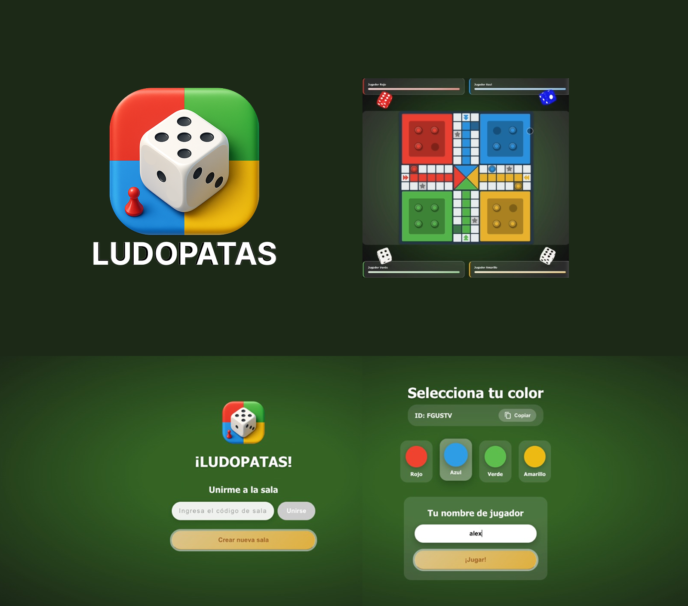

# Ludopatas!

## Introduccion

Juego de Ludo web, para jugar con mi novia sin tener que comerme todos los ads de la store.

Probablemente lo publique gratis en las store con un capacitor, pero creo que ahi le voy a dedicar un poco de tiempo a la escala de css porque el tablero esta medio picado para el responsive y lo solucioné rapido con un scale, aunque no es dificil de corregir me da paja.

## Screenshots



## Roadmap:

### Bugfixing

### Capacitor -> Stores

### Monetizacion

No quiero mas juegos con 300 ads, asique no le vamos a poner eso, tampoco quiero cobrar por jugar, quiza hago la gran LOL y le meto unos skins a algo, y algunos efectos tranquis a ver si alguien se paga un pase de batalla que le de skins o cosas por jugar, capaz que un pase es una banda, pero un par de skins todas por 1 dolar, capaz lo pagan para arrancar.

Por que quiero monetizarlo? y... si lo juego mucho lo voy a bugfixear, si lo bugfixeo y esta flamita capaz lo subo a las stores, si lo subo a las stores capaz tracciona capaz no, considerando que va a ser el unico sin ads full-free, si esto escala voy a necesitar infra y corregir el watchdog... entonces hay que monetizar porque sino esto no va a funcionar.

### Escalabilidad

* Corregir watchdog -> sockets
* Multi-instancias (crear un router y meter capacidad a cada instancia que levante)
* Login -> State a db, para poder comprar las skins?
* Skins (yes sure...)
* 

## Estado del arte

Este mvp es un juego de ludo, que no quiere ser un gran proyecto ni perfecto, simplemente un juego funcional que pueda regalarle a mi novia y lo pueda hacer en mis tiempos libres.

Partiendo de esa base comence armando un frontend en el que inverti unas 4 horas, luego para el backend fui un poco mas mesquino y lo hice trabajar al cursor+chatgpt.

Empecé por definir que no quería programar algo basado en websocket aunque considero que es la mejor opción, porque implica implementar un montón de lógica y supongo que a cursor se le va a complicar, y yo ganas de codear no tengo.

Acto seguido procedi a buscar una libreria boardgame.io, pero cursor se pegaba unos mareos maestros y me creo un backend API y un backend Boardgame, pero para sincronizar players y joins no se avivó que dos backends no iban a estar sincronizados, asique quería despues agregar un modulo de sincronización, y todos sabemos que esta arquitectura termina mal, principalmente cuando queres expandirlo a una escala grande, se arma un chino.

Asique procedí a pedirle que lo simplifique todo en un REST con un watchdog, uno diría izi porque salió andando al otro día y luego corregí un par de bugs y a prod...

Pero todos sabemos que la escala de consumo de bandwidth que tiene un watchdog multisala para varios jugadores en linea va a ser un caos, asique voy a salir con este mvp y si la cosa se pone peluda voy a tratar de que cursor migre a websockets el watchdog y vemos cual pasa.

Sino bueno, aca volveremos al ruedo a codear como enfermitos para sacar juegazo, pero por el momento me parece ok.

## Levantar ambiento

bueno el front es un angular de toda la vida, ```npm i```, ```ng serve``` o ```npm run start```

y el back, es un node sin persistencia ni nada, yo te diria que tires un pnpm i y presiones el launch del visual, o si no te gusta el debug, podes usar ```nest start``` o ```npm run start:dev```